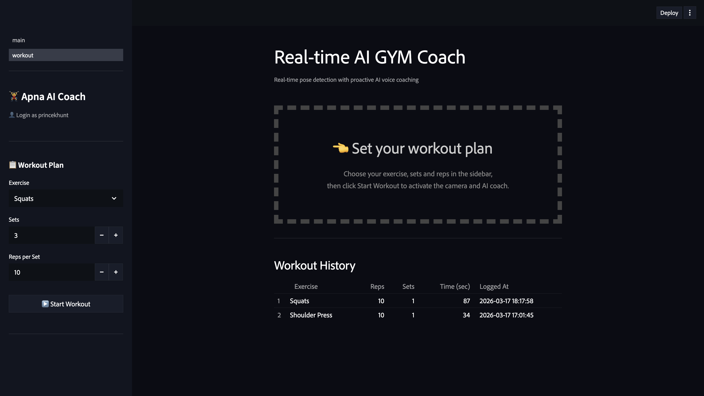
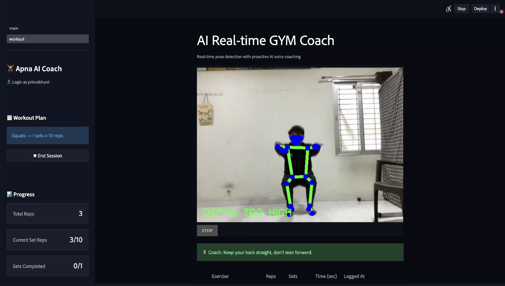

# 🧠 AI Gym Coach – Backend App

Backend engine powering the **Real‑time AI Gym Coach** project.  
It handles pose detection, exercise tracking, and connects seamlessly with the Gym‑Coach‑UI frontend.

---

## ⚙️ Features
- Real‑time exercise detection using ML models  
- RESTful API endpoints for frontend integration  
- User progress and workout history management  
- Lightweight Flask server for easy deployment  
- Modular structure for scalability and maintenance  

---

## 📂 Project Structure
Main App/
│
├── core/           
├── detectors/      
├── ml_models/      
├── pages/          
├── services/       
├── static/         
├── main.py         
├── requirements.txt
└── .env            # Environment variables (ignored in Git)

---

## 🧠 Screenshots
Add your backend or detection screenshots here:

---

## 🎥 Demo Video
[Demo Video](videos/video.mp4)

